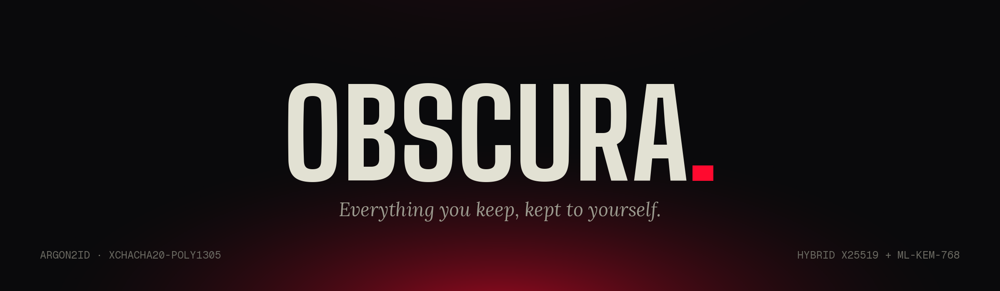
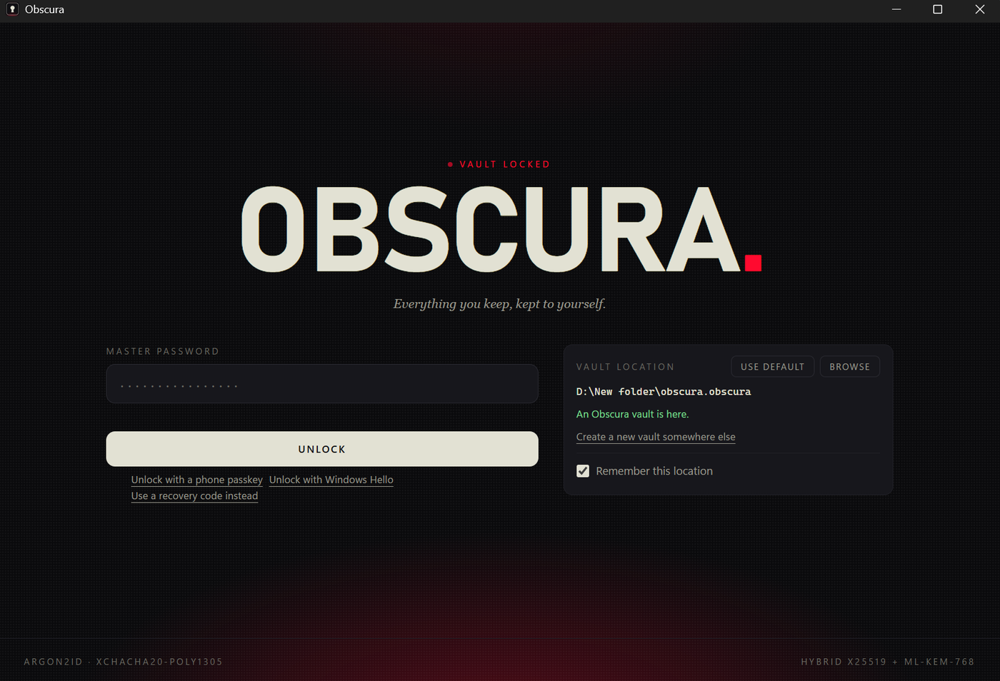
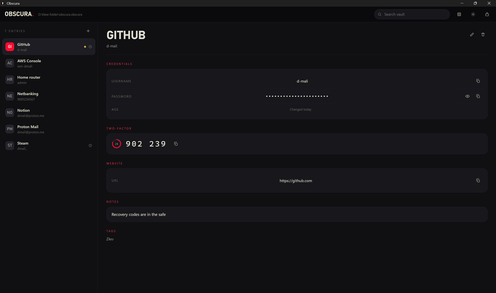
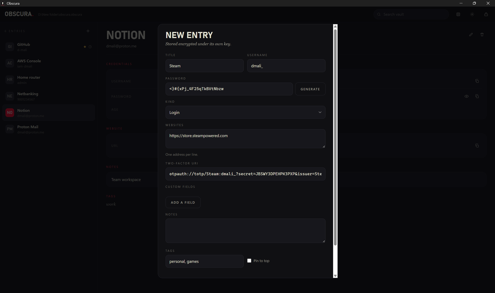
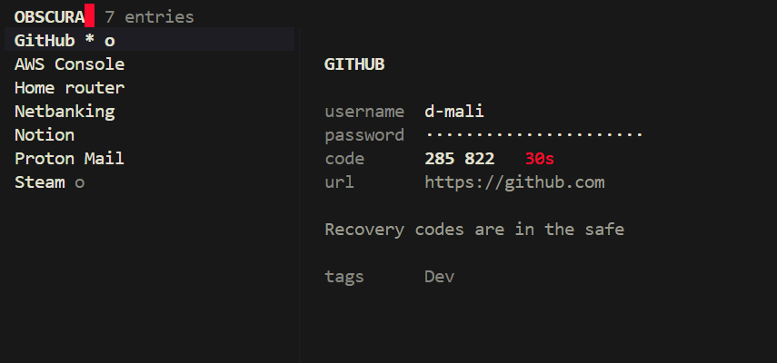
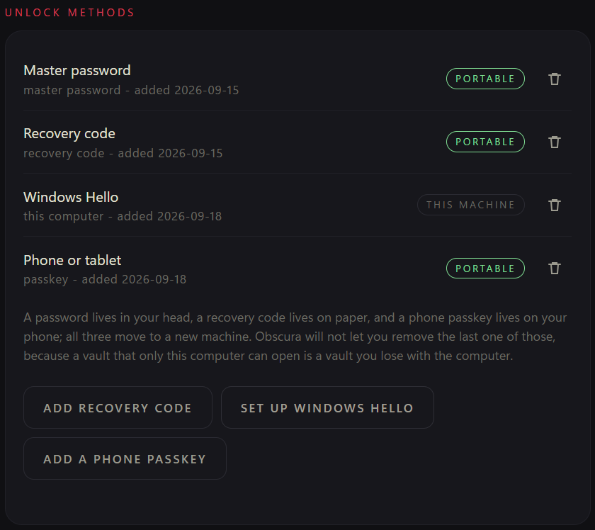

<p align="center">
  
</p>

<p align="center">
  <a href="https://github.com/DebanganMALI/Obscura/actions/workflows/ci.yml"></a>
  
  
  
</p>

# Obscura

Every password manager asks you to trust something. A hosted one asks you to
trust its servers and whoever can reach them. Your browser's asks you to trust
the browser. Obscura asks you to trust **one file on your own disk** — and then
gives you the means to check that the file, and the program that opens it, are
what they claim to be.

No account. No telemetry. No network code at all — not a disabled feature, but
an application with no HTTP client in it.

> **Status: first public release.** Obscura has not been independently audited
> and the interface has no automated test coverage. Keep a second copy of
> anything you cannot afford to lose.

## Screenshots

<p align="center">
  
</p>

Four ways in, and the vault tells you which of them travel with you.

<p align="center">
  
</p>

<p align="center">
  
</p>

<p align="center">
  
</p>

`obscura` on its own opens the vault in the terminal — the same entries, the
same codes, no window manager required.

## Features

- **Argon2id**, calibrated at vault creation against your actual hardware, so a
  fast machine buys you a slower attacker rather than a faster unlock
- **XChaCha20-Poly1305** with a separate key per entry, derived via HKDF-SHA512
- **Envelope encryption** — one 32-byte vault key, wrapped once per unlock
  method. Changing your master password rewraps that key; it does not re-encrypt
  a single entry
- **Hybrid X25519 + ML-KEM-768** key wrapping, so a vault copied today is not
  opened in fifteen years by a machine that breaks the classical half
- **Four ways to unlock** — master password, Windows Hello, a phone or tablet
  passkey, or a printed recovery code
- **Rollback detection** — a keyed BLAKE3 watermark kept outside the vault and
  checked at every unlock, so a restored older copy is noticed rather than
  silently accepted
- **TOTP codes**, a password generator, CSV import from other managers, and
  encrypted export
- **Auto-lock on idle**, timed against both a monotonic and a wall clock, so a
  machine that slept through the timeout still locks
- **Clipboard copies that clear themselves** and opt out of Windows clipboard
  history and Linux clipboard managers
- **A command line tool**, `obscura`, that browses or scripts the same vault

<p align="center">
  
</p>

## Install

Installers are attached to each [release](https://github.com/DebanganMALI/Obscura/releases).

| Platform | File |
| --- | --- |
| Windows | `Obscura_0.1.0_x64-setup.exe` |
| Windows, MSI | `Obscura_0.1.0_x64_en-US.msi` |
| Debian, Ubuntu | `Obscura_0.1.0_amd64.deb` |
| Fedora, RHEL | `Obscura-0.1.0-1.x86_64.rpm` |
| Any Linux | `Obscura_0.1.0_amd64.AppImage` |

### Windows will warn you

The installers are not code signed, so SmartScreen shows "Windows protected
your PC" the first time you run one. Choose **More info**, then **Run anyway**.

That warning is not a formality being skipped. A certificate that removes it
costs 150 to 300 US dollars a year and requires a hardware token, extended
validation certificates stopped bypassing SmartScreen in 2024, and Microsoft's
free signing service is not offered to individuals outside the USA and Canada.
So rather than buy the absence of a warning, Obscura publishes something you
can check yourself.

## Verifying what you downloaded

Two checks, and the second is the one that matters.

**The checksum** tells you the file arrived intact. Every release includes a
`SHA256SUMS` file.

```powershell
Get-FileHash .\Obscura_0.1.0_x64-setup.exe -Algorithm SHA256
```

```sh
sha256sum -c SHA256SUMS --ignore-missing
```

**The build provenance** tells you where the file came from. Every installer
carries a signed attestation, recorded in a public transparency log, naming the
commit and the workflow run that produced it.

```sh
gh attestation verify Obscura_0.1.0_x64-setup.exe --repo DebanganMALI/Obscura
```

A checksum only proves the file matches a list published beside it, so anyone
able to replace the installer could replace the list too. An attestation cannot
be forged without push access to this repository, and the log is append-only and
public. If you verify one thing, verify this.

## Usage

### The application

Open it, choose where the vault lives, set a master password. That is the whole
setup — there is nothing to sign up for.

Add a recovery code before you add anything you care about. It is the only
unlock method that survives losing both your memory and your machine, and
Obscura will not let you remove your last portable one.

### The command line

```sh
export OBSCURA_VAULT=~/.local/share/obscura/vault.obscura

obscura                   # browse the vault in the terminal
obscura list              # titles and usernames, never a password
obscura list git          # only matching entries
obscura get github        # the password, to stdout
obscura totp github       # the current code, to stdout
```

In the browser: `j`/`k` to move, `/` to filter, `p` `u` `t` to copy the
password, username or code, `r` to reveal, `?` for the keys, `q` to quit.

Three rules are built into all of it:

- **The master password is never an argument.** It is read from the terminal
  without echo, or from stdin when stdin is not a terminal, so it never reaches
  the process list or your shell history. `pass show master | obscura get
  github` works.
- **Secrets go to stdout and everything else to stderr**, so
  `obscura totp github | wl-copy` copies six digits and nothing else — the
  banner, the countdown and the colour all go elsewhere.
- **An ambiguous query is an error, never a guess.** If `get git` matches two
  entries it lists them and exits non-zero. It will not pick one for you.

`list`, `get` and `totp` open the vault, do one thing and exit — no agent, no
cache, no socket. Browsing holds the vault open until you quit or it locks on
idle, and wipes the clipboard on the way out.

## How it works

Your master password never encrypts anything directly. Argon2id turns it into a
key that unwraps **one 32-byte vault key**, and every other unlock method
unwraps that same key a different way. A recovery code is not a weaker back
door; it opens exactly the same lock.

```
master password ──Argon2id(salt)──────> slot key ─┐
recovery code ──X25519 + ML-KEM-768 ──────────────┼──> VAULT KEY ──┬─> entry keys
passkey ──WebAuthn PRF(salt from vault id)────────┘                └─> watermark key
```

That indirection is why changing your master password is instant on a vault of
any size, and why adding a passkey touches nothing but a single header field.

The vault file itself is one file: an eight-byte magic, a version, a
**plaintext CBOR header**, and a sealed body. The header is deliberately not
encrypted, because it *is* the body's additional authenticated data — edit any
part of it and the body stops decrypting rather than decrypting into something
else.

Being specific about what that leaks: without any credential, someone holding
your vault file can read its id, its timestamps, its revision number, the
Argon2id cost, and **how many unlock methods it has, of what kind, with what
labels**. They cannot learn how many entries exist, how large any of them is, or
anything about their contents.

[**docs/architecture.md**](docs/architecture.md) has the byte layout, the full
key hierarchy, the unlock and save sequences, and an annotated file tree.

## Architecture

Five library crates and two front ends. The cryptography does not know what a
vault is, the vault does not know what an operating system is, and neither knows
there is a user interface.

```
obscura-crypto     Argon2id · XChaCha20-Poly1305 · HKDF-SHA512
                   keyed BLAKE3 · hybrid X25519 + ML-KEM-768
        |
obscura-vault      file format · entries · key slots · TOTP
                   recovery codes · generator · CSV import · export
        |
        +---------------------------+
        |                           |
src-tauri + ui/              obscura-cli
Tauri commands, session      list · get · totp · browse
watermark, clipboard         banner, colour, ratatui
        |
obscura-platform   Windows Hello, file permissions
obscura-webauthn   WebAuthn PRF for phone passkeys
```

`obscura-platform` and `obscura-webauthn` compile to stubs where the underlying
API does not exist, so the workspace builds on every target.

## Requirements

| | |
| --- | --- |
| Windows | 10 version 1809 or newer, x64 |
| Linux | any desktop with WebKitGTK 4.1 |
| Windows Hello | a machine with Hello already set up |
| Phone passkeys | Windows with WebAuthn API version 4 or newer, and a phone that supports passkeys |
| Terminal browser | any terminal; colour is skipped when `NO_COLOR` is set or output is piped |

The interface is three static files with no npm dependencies and a
`default-src 'none'` content security policy.

## Build from source

```sh
cargo build --workspace
cargo nextest run --workspace
```

The desktop application needs the Tauri CLI:

```sh
cargo install tauri-cli --version "^2" --locked
cargo tauri build
```

## Testing and quality

- **Property tests** over the cryptography, and RFC 6238 vectors for TOTP
- **Five fuzz targets** — the header decoder, whole-vault parsing, the portable
  export decoder, CSV import, and recovery code parsing
- **Mutation testing.** 544 mutants generated, 464 caught. Of the fifteen that
  survived, fourteen were proved equivalent by hand and the fifteenth is a real
  gap that safe Rust cannot express, documented rather than hidden
- `cargo deny` for licences and advisories, `gitleaks` for secrets, and
  Dependabot on the lockfile
- Clippy at `pedantic`, with `unwrap_used` and `mem_forget` denied outright

What the suite does **not** cover, and why, is in
[docs/testing.md](docs/testing.md) and
[docs/mutation-testing.md](docs/mutation-testing.md). The short version: the
interface has no automated tests at all, and every bug found by using the
application this month was found by clicking, not by a test.

## Security

Report vulnerabilities as described in [SECURITY.md](SECURITY.md).

Obscura collects nothing and makes no network requests. See
[docs/privacy-policy.md](docs/privacy-policy.md).

## Licence

GPL-3.0-or-later. See [LICENSE](LICENSE).

## Author

Built by [Debangan Mali](https://github.com/DebanganMALI), who also wrote
[Salt-miner](https://github.com/DebanganMALI/Salt-miner).
